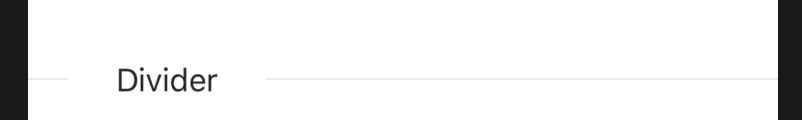
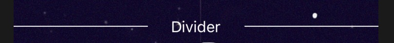

# rn-divider

a divider component for react-natives

# Install

```js
yarn add rn-divider
// or
npm install rn-dividers --save
```

# usage

```js
import Divider from 'rn-dividers';

<Divider>Divider</Divider>;
```



# Props

| Prop          | Type                          | default           | Description                                                    |
| ------------- | ----------------------------- | ----------------- | -------------------------------------------------------------- |
| `dashed`      | Boolean                       | false             | whether line is dashed                                         |
| `orientation` | enum: `left` `center` `right` | left              | this is optional, if not set it will have the text in the left |
| `borderColor` | String                        | `#e8e8e8`         | line color                                                     |
| `color`       | String                        | `rgba(0,0,0,.85)` | font color                                                     |

example:

```js
import Divider from 'rn-dividers';

<Divider borderColor="#fff" color="#fff" orientation="center">
    Divider
</Divider>;
```


